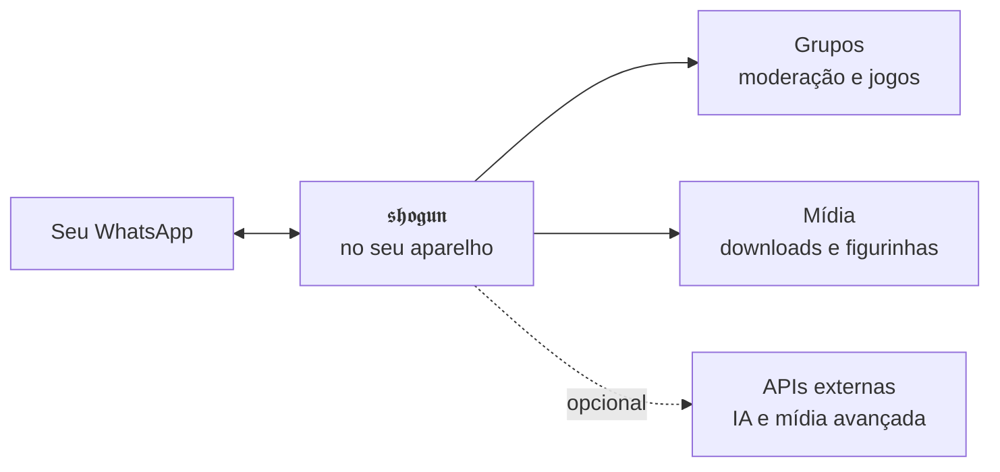

<p align="center">
  
</p>

<h1 align="center">𝖘𝖍𝖔𝖌𝖚𝖓</h1>

<p align="center">
  <strong>Um bot para os seus grupos de WhatsApp.</strong><br>
  Ele modera, trabalha com mídia, faz figurinhas, joga e mantém um RPG inteiro.<br>
  Roda no seu computador ou num celular Android pelo Termux.
</p>

<p align="center">
  
  &nbsp;&nbsp;
  
</p>

<p align="center">
  <sub>O painel de conexão e o acompanhamento ao vivo do bot em execução.</sub>
</p>

---

## 👉 Nunca instalou nada assim? Comece por aqui

Escolha onde o bot vai rodar. Os guias seguem os scripts e o fluxo que existem de fato neste repositório público.

<table>
<tr>
<td align="center" width="25%">
<a href="docs/instalacao/termux.md"><strong>📱 Android</strong></a><br>
<sub>Termux</sub><br>
<sub>15 a 35 min</sub><br>
<sub><a href="https://f-droid.org/packages/com.termux/">obter Termux</a></sub>
</td>
<td align="center" width="25%">
<a href="docs/instalacao/windows.md"><strong>🪟 Windows</strong></a><br>
<sub>Windows 10 ou 11</sub><br>
<sub>10 a 20 min</sub>
</td>
<td align="center" width="25%">
<a href="docs/instalacao/linux.md"><strong>🐧 Linux</strong></a><br>
<sub>Desktop ou servidor</sub><br>
<sub>10 a 20 min</sub>
</td>
<td align="center" width="25%">
<a href="docs/instalacao/macos.md"><strong>🍎 macOS</strong></a><br>
<sub>Intel ou Apple Silicon</sub><br>
<sub>10 a 20 min</sub>
</td>
</tr>
</table>

<p align="center">
  
  &nbsp;&nbsp;
  
</p>

---

## Vai rodar no Android?

Para a linha tradicional do Termux, prefira uma das fontes oficiais abaixo:

**[F-Droid](https://f-droid.org/packages/com.termux/)** · **[GitHub Releases](https://github.com/termux/termux-app/releases)**

A edição do Google Play voltou a existir, mas segue uma linha experimental com diferenças de compatibilidade. O guia do SHOGUN usa a linha tradicional de F-Droid/GitHub para reduzir variações de ambiente.

Depois siga o [guia do Android](docs/instalacao/termux.md), que corresponde ao instalador `scripts/install-termux.sh` e ao painel real do bot.

## Já usa terminal? Comece em três minutos

```bash
git clone https://github.com/dgreych/shogun.git
cd shogun
bash scripts/install-linux.sh   # macOS: install-macos.sh · Android: install-termux.sh
npm start
```

No Windows, use `powershell -ExecutionPolicy Bypass -File .\scripts\install-windows.ps1`.

O primeiro boot abre o painel de conexão e oferece QR Code ou código de pareamento. Se a palavra "terminal" já assusta, comece pelo [guia da sua plataforma](#-nunca-instalou-nada-assim-comece-por-aqui).

## Como funciona



A sessão e os dados dos grupos ficam **no aparelho onde você executa o bot**. Integrações externas só entram quando o recurso correspondente é configurado.

## O que ele faz

**Cuida do grupo.** Boas-vindas, anti-link, anti-flood, advertências, moderação e automações de administração.

**Trabalha com mídia.** O runtime inclui fluxos de download, conversão, áudio, imagem e figurinhas. Recursos que dependem da BunnyFy ou de outro serviço externo precisam da integração correspondente configurada.

**Conversa e gera mídia por IA quando configurado.** O núcleo local não exige chave de IA para iniciar. Recursos externos permanecem opcionais.

**Tem economia, RPG e jogos.** O bot mantém sistemas persistentes por grupo e comandos interativos no próprio WhatsApp.

## Configuração

<p align="center">
  
</p>

<p align="center">
  <sub><code>npm run preflight</code> confere Node.js, npm, Git, FFmpeg e detecta a plataforma antes do boot.</sub>
</p>

O instalador pergunta seu nome, seu número com país e DDD, o nome do bot e o prefixo dos comandos. A configuração local é escrita em `dados/src/config.json`.

## Manutenção

```bash
npm run preflight   # confere o ambiente
npm run setup       # refaz a configuração inicial
npm start           # inicia o bot
```

Atualizar:

```bash
git pull --ff-only && npm ci --no-audit --no-fund && npm start
```

## Dúvidas frequentes

**Preciso de um número separado?** É fortemente recomendado. O bot conecta como aparelho vinculado e responde por essa conta.

**Preciso deixar o aparelho ligado?** Sim, enquanto quiser o bot no ar. No Android, use `termux-wake-lock` e retire o Termux da otimização agressiva de bateria.

**Funciona sem chave de IA?** Sim. O núcleo do bot inicia e conecta sem chave de IA. Recursos que chamam provedores externos dependem da configuração daquele provedor.

**O Termux precisa do aplicativo Termux:API para `termux-wake-lock`?** Não. O wake lock vem das ferramentas do próprio Termux; se o comando estiver ausente, atualize `termux-tools`.

## Segurança

A pasta `dados/database/qr-code/` guarda a sessão do WhatsApp. **Quem obtiver essa pasta pode comprometer a sessão vinculada.** Não compacte, não envie e não publique. Ela já está protegida pelo `.gitignore`.

## Requisitos

<p>
  
  
  
  
</p>

Node.js 20.19 ou superior · FFmpeg · Git · um número de WhatsApp para a sessão do bot

## Portabilidade verificada

O workflow público valida o lockfile e a construção do projeto em Windows, Linux e macOS. O contrato do Termux é validado separadamente no CI, e o instalador Android usa apenas pacotes disponíveis no ecossistema Termux.

## Licença

Publicado sob a licença ISC. Veja [LICENSE](LICENSE) e [NOTICE](NOTICE).
