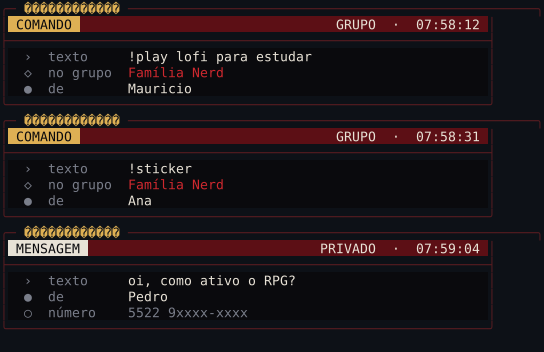
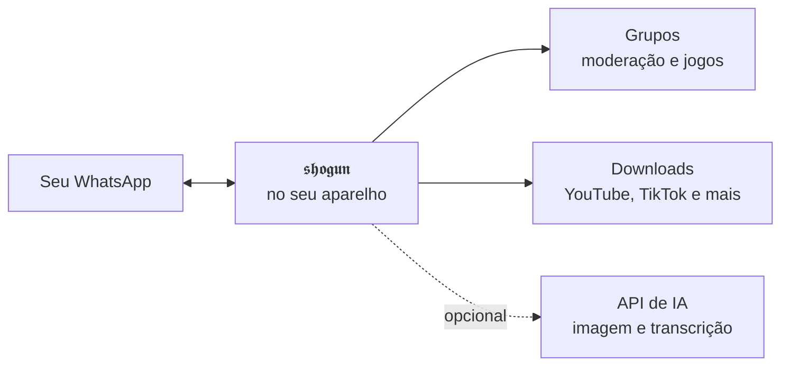

<p align="center">
  
</p>

<h1 align="center">𝖘𝖍𝖔𝖌𝖚𝖓</h1>

<p align="center">
  <strong>Um bot de WhatsApp que roda no seu computador — ou num celular Android parado na gaveta.</strong>
</p>

<p align="center">
  
  
  
  
</p>

<p align="center">
  <a href="docs/instalacao/termux.md"><strong>Instalar no Android</strong></a> ·
  <a href="docs/instalacao/windows.md"><strong>Windows</strong></a> ·
  <a href="docs/instalacao/linux.md"><strong>Linux</strong></a> ·
  <a href="https://chat.whatsapp.com/Ju0zjLiBLe28eNGUu2gapY"><strong>Grupo de ajuda</strong></a>
</p>

---

## 👉 Nunca instalou nada assim? Comece por aqui

Escolha onde o bot vai rodar. Cada guia começa do zero, mostra **o que aparece
na sua tela** a cada passo e o que fazer quando não aparece.

<table>
<tr>
<td align="center" width="33%">
<a href="docs/instalacao/termux.md"><strong>📱 Android</strong></a><br>
<sub>Celular reserva na tomada</sub><br>
<sub>15 a 35 min</sub>
</td>
<td align="center" width="33%">
<a href="docs/instalacao/windows.md"><strong>🪟 Windows</strong></a><br>
<sub>10 ou 11, no seu PC</sub><br>
<sub>10 a 20 min</sub>
</td>
<td align="center" width="33%">
<a href="docs/instalacao/linux.md"><strong>🐧 Linux</strong></a><br>
<sub>Desktop, mini PC ou servidor</sub><br>
<sub>10 a 20 min</sub>
</td>
</tr>
</table>

<p align="center">
  
  &nbsp;&nbsp;
  
</p>

<p align="center">
  <sub>À esquerda, a tela de conexão. À direita, o feed ao vivo — cada comando
  e mensagem que chega aparece assim no seu terminal.</sub>
</p>

---

## Já usa terminal? Comece em três minutos

```bash
git clone https://github.com/dgreych/shogun.git
cd shogun
bash scripts/install-linux.sh   # Windows: install-windows.ps1 · Android: install-termux.sh
npm start
```

Leia o QR no WhatsApp, mande `!menu` no grupo e pronto. Se a palavra "terminal"
já assusta, comece pelo [guia da sua plataforma](#-nunca-instalou-nada-assim-comece-por-aqui) — ele explica cada
tela, sem pressupor nada.

## Como funciona



A sessão e os dados dos grupos ficam **no seu aparelho**. Nada de servidor de
terceiro, salvo as APIs que você mesmo configurar.

## O que ele faz

**Cuida do grupo.** Boas-vindas, anti-link, anti-flood e advertências com
banimento automático na terceira. Moderadores com permissões próprias, separadas
das do administrador do WhatsApp. Silenciar quem está atrapalhando, abrir e
fechar o grupo por horário.

**Resolve mídia.** Baixa de YouTube, TikTok, Instagram, Twitter, Facebook,
Pinterest e Kwai. Vídeo vira áudio, áudio vira texto, imagem vira figurinha e
figurinha vira imagem. Faz figurinha animada de vídeo curto e mistura dois
emojis num só.

**Gera imagem por IA.** Texto vira imagem, remove fundo, aumenta resolução. O
roteador escolhe o modelo pelo tipo de pedido: pedido rápido vai para o modelo
rápido, pedido caprichado vai para o modelo de qualidade.

**Conversa.** A assistente responde quando mencionada. Cada grupo escolhe a
personalidade, e ela muda o tom das respostas e o visual dos menus junto.

**Tem um RPG inteiro.** Trabalho, mineração, pesca, caça, forja, plantio,
cozinha, propriedades que rendem por dia, mercado entre jogadores, habilidades
que evoluem e ranking. Cada grupo tem a própria economia.

**E jogos.** Velha, forca, quiz, roleta, caça-palavras e uma taverna de duelos
por turnos.

## Configuração

<p align="center">
  
</p>

<p align="center">
  <sub><code>npm run preflight</code> confere tudo que o bot precisa antes de você começar.</sub>
</p>

O instalador pergunta seu nome, seu número com país e DDD, o nome do bot e o
prefixo dos comandos. Nada disso sai do seu aparelho.

## Manutenção

```bash
npm run preflight   # confere Node.js, npm, Git, FFmpeg e a plataforma
npm run setup       # refaz a configuração inicial
npm start           # inicia o bot
```

Atualizar:

```bash
git pull --ff-only && npm ci --no-audit --no-fund && npm start
```

## Dúvidas frequentes

**Preciso de um número separado?** Sim. Use um chip só do bot — ele conecta
como aparelho vinculado e responde por essa conta.

**Preciso deixar o computador ligado?** Sim, enquanto quiser o bot no ar. Por
isso muita gente usa um Android antigo na tomada.

**Funciona sem chave de IA?** Funciona. Moderação, downloads, figurinhas, jogos
e RPG não dependem de IA. Só geração de imagem e transcrição precisam.

**Vão banir meu número?** O bot usa a conexão oficial de aparelhos vinculados.
O que causa bloqueio é comportamento: disparo em massa e spam. Use com bom
senso.

**Meus dados vão para algum servidor?** Não. Sessão, bancos e configuração
ficam no aparelho onde o bot roda.

## Segurança

A pasta `dados/database/qr-code/` guarda a sessão do WhatsApp. **Quem tem essa
pasta entra na sua conta**: não compacte, não envie, não publique. Ela já está
protegida pelo `.gitignore`.

## Requisitos

Node.js 20.19 ou superior · FFmpeg · Git · um número de WhatsApp dedicado

## Licença

Publicado sob a licença ISC. Veja [LICENSE](LICENSE) e [NOTICE](NOTICE).
