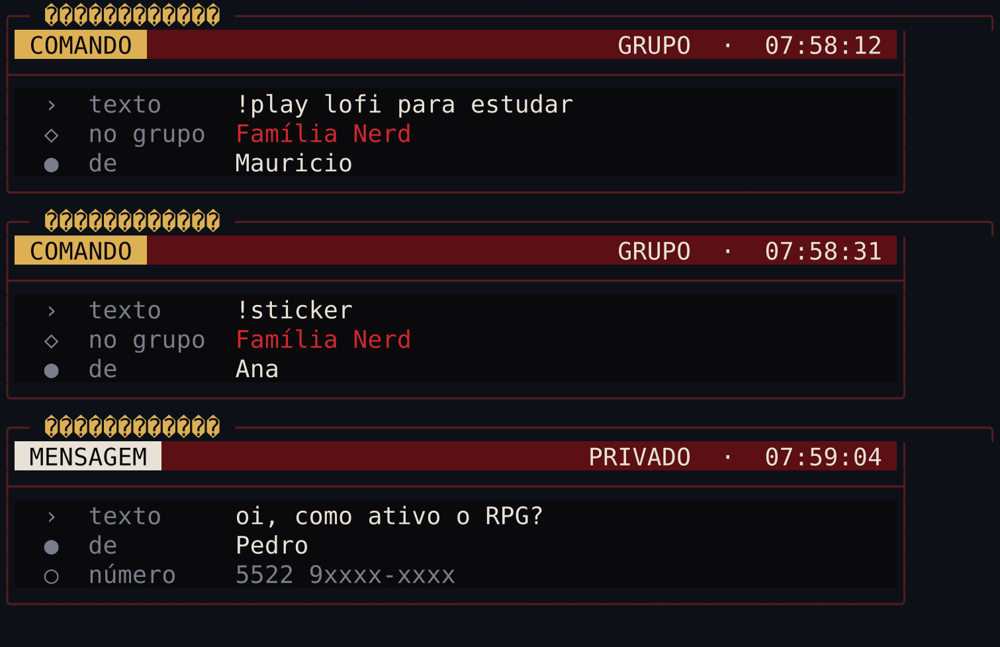
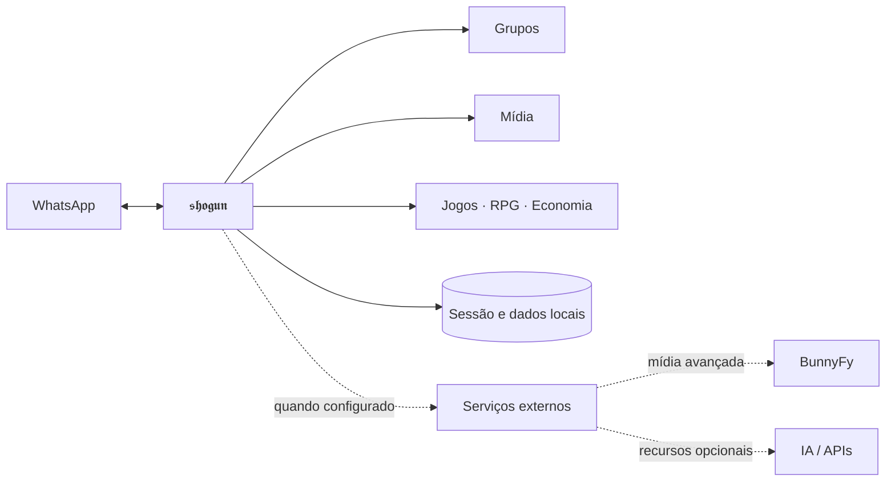

<p align="center">
  
</p>

<h1 align="center">𝖘𝖍𝖔𝖌𝖚𝖓</h1>

<p align="center">
  <strong>Seu grupo não precisa de mais um bot. Precisa de um sistema.</strong><br>
  Moderação, mídia, jogos, economia e automações em uma única experiência para WhatsApp.
</p>

<p align="center">
  
  
  
  
</p>

<p align="center">
  <a href="#-instale-onde-quiser"><strong>Instalar</strong></a>
  &nbsp;•&nbsp;
  <a href="#-o-que-vem-no-shogun"><strong>Recursos</strong></a>
  &nbsp;•&nbsp;
  <a href="#-como-ele-se-organiza"><strong>Arquitetura</strong></a>
  &nbsp;•&nbsp;
  <a href="docs/primeiros-passos.md"><strong>Primeiros passos</strong></a>
  &nbsp;•&nbsp;
  <a href="docs/solucao-de-problemas.md"><strong>Problemas</strong></a>
</p>

---

<table>
<tr>
<td width="55%" valign="top">

### Um bot que realmente vive no grupo

O SHOGUN foi pensado para grupos que querem mais do que meia dúzia de respostas automáticas. Ele combina administração, mídia, interação entre membros, economia persistente, RPG e recursos opcionais de IA sem transformar a instalação numa peregrinação por quinze serviços obrigatórios.

- **funciona sem IA** e ganha recursos extras quando integrações são configuradas;
- **mantém sessão e dados localmente** no aparelho onde está rodando;
- **trata Termux como plataforma de verdade**, não como nota de rodapé;
- **separa o núcleo do bot de serviços externos**, evitando que uma API indisponível derrube tudo.

</td>
<td width="45%" align="center" valign="middle">
  <br>
  <sub>Painel de conexão e primeira execução.</sub>
</td>
</tr>
</table>

<p align="center">
  
</p>
<p align="center"><sub>Mensagens e comandos chegando em tempo real. Sem painel web obrigatório, sem teatro.</sub></p>

---

## ✦ O que vem no SHOGUN

<table>
<tr>
<td width="33%" valign="top">
<h3>🛡️ Moderação</h3>
Boas-vindas, anti-link, anti-flood, advertências, controles administrativos e automações para manter o grupo utilizável quando os humanos resolvem testar os limites da civilização.
</td>
<td width="33%" valign="top">
<h3>🎞️ Mídia</h3>
Figurinhas, conversões, áudio, imagem e fluxos de download. Capacidades avançadas podem usar a BunnyFy quando configuradas.
</td>
<td width="33%" valign="top">
<h3>🎮 Jogos</h3>
Brincadeiras, comandos sociais e experiências interativas pensadas para acontecer dentro da conversa, sem mandar todo mundo para outro aplicativo.
</td>
</tr>
<tr>
<td width="33%" valign="top">
<h3>🪙 Economia & RPG</h3>
Progressão, inventário, recursos persistentes e sistemas de grupo que continuam existindo depois que a mensagem some do histórico.
</td>
<td width="33%" valign="top">
<h3>🧠 IA opcional</h3>
O núcleo inicia sem chave de IA. Quando provedores externos são configurados, o SHOGUN libera conversação e geração de mídia sem acoplar o boot a eles.
</td>
<td width="33%" valign="top">
<h3>💾 Estado local</h3>
Sessão, configuração e bancos pertencem à instalação. Atualizar o código não deveria significar sacrificar o estado vivo do bot aos deuses do `rm -rf`.
</td>
</tr>
</table>

---

## ⬇ Instale onde quiser

<table>
<tr>
<td align="center" width="25%">
<h3>📱 Android</h3>
<strong>Termux</strong><br><br>
<a href="docs/instalacao/termux.md">Guia completo →</a><br>
<sub>F-Droid ou GitHub Releases</sub>
</td>
<td align="center" width="25%">
<h3>🪟 Windows</h3>
<strong>Windows 10/11</strong><br><br>
<a href="docs/instalacao/windows.md">Guia completo →</a><br>
<sub>PowerShell</sub>
</td>
<td align="center" width="25%">
<h3>🐧 Linux</h3>
<strong>Desktop / servidor</strong><br><br>
<a href="docs/instalacao/linux.md">Guia completo →</a><br>
<sub>Bash</sub>
</td>
<td align="center" width="25%">
<h3>🍎 macOS</h3>
<strong>Intel / Apple Silicon</strong><br><br>
<a href="docs/instalacao/macos.md">Guia completo →</a><br>
<sub>Bash + Homebrew</sub>
</td>
</tr>
</table>

> [!IMPORTANT]
> No Android, use preferencialmente a linha tradicional do **Termux pelo F-Droid ou GitHub Releases**. A edição do Google Play segue uma linha diferente e pode apresentar incompatibilidades que o guia do SHOGUN não assume.

### Terminal já não mete medo?

```bash
git clone https://github.com/dgreych/shogun.git
cd shogun
bash scripts/install-linux.sh   # Android: install-termux.sh | macOS: install-macos.sh
npm start
```

No Windows:

```powershell
powershell -ExecutionPolicy Bypass -File .\scripts\install-windows.ps1
npm start
```

A primeira execução abre o fluxo de conexão e oferece **QR Code** ou **código de pareamento**. Depois disso, a sessão é reaproveitada nas próximas inicializações.

---

## ◈ Como ele se organiza



O bot continua responsável pelo fluxo do WhatsApp e pelo estado do grupo. Integrações externas entram como capacidades adicionais, não como condição para o processo existir.

---

## ✓ Primeira inicialização

<table>
<tr>
<td width="33%" align="center"><strong>1. Verifique</strong><br><sub><code>npm run preflight</code><br>confere Node, npm, Git e FFmpeg.</sub></td>
<td width="33%" align="center"><strong>2. Configure</strong><br><sub><code>npm run setup</code><br>define dono, nome e prefixo.</sub></td>
<td width="33%" align="center"><strong>3. Conecte</strong><br><sub><code>npm start</code><br>abre QR ou pareamento.</sub></td>
</tr>
</table>

<p align="center">
  
</p>

A configuração local fica em `dados/src/config.json`. A sessão do WhatsApp fica em `dados/database/qr-code/`.

> [!CAUTION]
> A pasta `dados/database/qr-code/` contém credenciais da sessão vinculada. **Não envie, compacte nem publique esse diretório.** Quem obtiver esses arquivos pode comprometer a conta conectada.

---

## ⚙ Operação do dia a dia

```bash
npm run preflight   # diagnóstico do ambiente
npm run setup       # configuração inicial
npm start           # iniciar
```

Para atualizar uma instalação existente:

```bash
git pull --ff-only
npm ci --no-audit --no-fund
npm run preflight
npm start
```

No Termux, mantenha o processo acordado com:

```bash
termux-wake-lock
```

O comando faz parte das ferramentas do Termux. **Não é necessário instalar o aplicativo Termux:API apenas para usar o wake lock.**

---

## ◉ Portabilidade verificada

A validação pública não se resume a “rodou na máquina de quem fez”. O workflow testa o projeto em combinações de Node.js sobre **Linux, Windows e macOS**, além de manter um contrato específico para os caminhos usados no **Termux**.

| Superfície | Verificação |
| --- | --- |
| Linux | instalação, build e validações do projeto |
| Windows | lockfile, runtime e portabilidade |
| macOS | Intel/Apple Silicon no caminho suportado pelo Node |
| Termux | instalador, dependências e contrato Android |

Requisito mínimo: **Node.js 20.19+**, npm, Git e FFmpeg.

---

## ? Dúvidas rápidas

<details>
<summary><strong>Preciso de um número separado?</strong></summary>
<br>
É fortemente recomendado. O SHOGUN funciona como aparelho vinculado à conta conectada.
</details>

<details>
<summary><strong>Preciso deixar o aparelho ligado?</strong></summary>
<br>
Sim. O processo precisa continuar rodando. No Android, use <code>termux-wake-lock</code> e retire o Termux da otimização agressiva de bateria.
</details>

<details>
<summary><strong>Funciona sem IA?</strong></summary>
<br>
Sim. IA e serviços externos são capacidades opcionais; o núcleo do bot não depende deles para iniciar.
</details>

<details>
<summary><strong>Onde começo se nunca usei terminal?</strong></summary>
<br>
Use o guia da sua plataforma. Ele acompanha os scripts existentes no repositório, em vez de mandar você executar uma coleção arqueológica de comandos copiados da internet.
</details>

---

## Documentação

**[Primeiros passos](docs/primeiros-passos.md)** · **[Segurança](docs/seguranca.md)** · **[Solução de problemas](docs/solucao-de-problemas.md)** · **[Termux](docs/instalacao/termux.md)** · **[Windows](docs/instalacao/windows.md)** · **[Linux](docs/instalacao/linux.md)** · **[macOS](docs/instalacao/macos.md)**

## Licença e créditos

Publicado sob a licença ISC. Consulte [LICENSE](LICENSE) e [NOTICE](NOTICE).