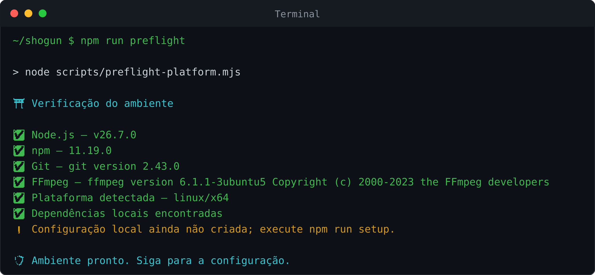

<h1 align="center">🐧 SHOGUN no Linux</h1>
<p align="center"><strong>Instalação em desktop ou servidor, com cada etapa verificável.</strong></p>

<p align="center">
  
  
  
</p>

## Rota completa

| Etapa | Ação | Sinal de sucesso |
| --- | --- | --- |
| **1** | instalar Git e FFmpeg | versões aparecem no terminal |
| **2** | instalar Node.js | `node --version` ≥ 20.19 |
| **3** | clonar o SHOGUN | pasta `~/shogun` criada |
| **4** | executar instalador | setup concluído |
| **5** | rodar preflight | requisitos obrigatórios aprovados |
| **6** | conectar WhatsApp | feed do bot ativo |
| **7** | testar | `!menu` responde |

---

## 1 · Prepare o sistema

Use **somente** o bloco correspondente à sua distribuição.

### Ubuntu · Debian · Linux Mint

```bash
sudo apt update
sudo apt install -y git ffmpeg curl
```

### Fedora

```bash
sudo dnf install -y git ffmpeg curl
```

### Arch Linux e derivados

```bash
sudo pacman -Syu --needed git ffmpeg curl
```

> [!NOTE]
> Quando `sudo` pede a senha, nenhum caractere aparece enquanto você digita. Isso é normal. O terminal não travou, ele só decidiu que feedback visual era luxo.

---

## 2 · Instale Node.js

O SHOGUN exige **Node.js 20.19.0 ou superior**. Para uma instalação nova, prefira uma linha LTS atual suportada pelo projeto.

Se sua distribuição já oferece uma versão adequada, instale `nodejs` e `npm` pelo gerenciador de pacotes. Caso contrário, use o método indicado na página oficial do Node.js.

Depois confira:

```bash
node --version
npm --version
git --version
ffmpeg -version
```

Se Node mostrar `v18`, ainda não terminou esta etapa.

---

## 3 · Baixe o projeto

```bash
cd ~
git clone https://github.com/dgreych/shogun.git
cd shogun
```

Confira:

```bash
pwd
```

O caminho deve terminar em `/shogun`.

---

## 4 · Execute o instalador

```bash
bash scripts/install-linux.sh
```

O instalador executa o preflight, instala as dependências travadas em `package-lock.json` e abre a configuração inicial.

<table>
<tr><td><strong>Seu nome</strong></td><td>identificação local do dono</td></tr>
<tr><td><strong>Número</strong></td><td>país + DDD + número, somente dígitos</td></tr>
<tr><td><strong>Nome do bot</strong></td><td>nome desta instalação</td></tr>
<tr><td><strong>Prefixo</strong></td><td>por exemplo <code>!</code></td></tr>
</table>

Para refazer apenas o setup depois:

```bash
npm run setup
```

---

## 5 · Verifique antes de iniciar

```bash
npm run preflight
```

<p align="center">
  
</p>

O comando verifica Node.js, npm, Git, FFmpeg, configuração e dependências locais.

---

## 6 · Inicie e conecte

```bash
npm start
```

Escolha **QR Code** ou **código de pareamento** no painel.

<p align="center">
  
</p>

No telefone, para QR, abra **WhatsApp → Aparelhos conectados → Conectar um aparelho**. Se QR não for conveniente, reinicie o fluxo e escolha pareamento por código.

A sessão criada é reutilizada nas próximas inicializações enquanto continuar válida.

---

## 7 · Teste de aceite

Envie em um grupo de teste:

```text
!menu
```

Se escolheu outro prefixo, substitua `!`.

**Recebeu resposta?** O núcleo instalou, conectou e está despachando comandos.

---

## Uso diário

### Parar

`Ctrl+C`

### Iniciar de novo

```bash
cd ~/shogun
npm start
```

### Atualizar

```bash
cd ~/shogun
git pull --ff-only
npm ci --no-audit --no-fund
npm run preflight
npm start
```

> [!TIP]
> Em servidor que ficará ligado continuamente, faça primeiro a instalação manual e confirme `!menu`. Só depois configure supervisão de processo. Isso separa problema de instalação de problema de serviço, uma pequena gentileza para o seu futuro eu.

Veja **[Implantação em servidor](../../DEPLOY.md)** para uma instalação pública supervisionada.

---

## Diagnóstico

<details>
<summary><strong><code>sudo: command not found</code></strong></summary>
<br>
Sua distribuição usa outro método de administração ou você está num ambiente restrito. Instale Git, Node.js e FFmpeg pelo mecanismo adequado ao sistema antes de continuar.
</details>

<details>
<summary><strong>Node ainda mostra v18</strong></summary>
<br>
Instale uma versão compatível e abra um novo terminal. Depois confirme com <code>node --version</code> e <code>npm run preflight</code>.
</details>

<details>
<summary><strong>Permissão negada no instalador</strong></summary>
<br>
Use <code>bash scripts/install-linux.sh</code>. Não é necessário marcar o arquivo executável para esse fluxo.
</details>

<details>
<summary><strong>A pasta <code>shogun</code> já existe</strong></summary>
<br>
Entre nela com <code>cd ~/shogun</code>; não clone outra cópia por cima.
</details>

---

## 🔐 Proteja o estado local

A sessão e a configuração devem sobreviver às atualizações:

```text
dados/database/
dados/src/config.json
.env.local
```

> [!CAUTION]
> Nunca publique a pasta de sessão. Ela contém material de autenticação do WhatsApp vinculado.

Para diagnóstico adicional, rode `npm run preflight` e consulte **[Solução de problemas](../solucao-de-problemas.md)**.

<p align="center"><a href="../../README.md">← Voltar à página principal</a></p>