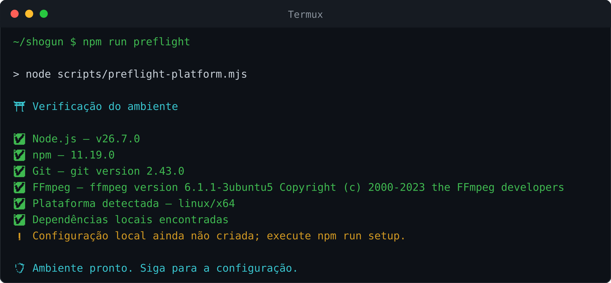
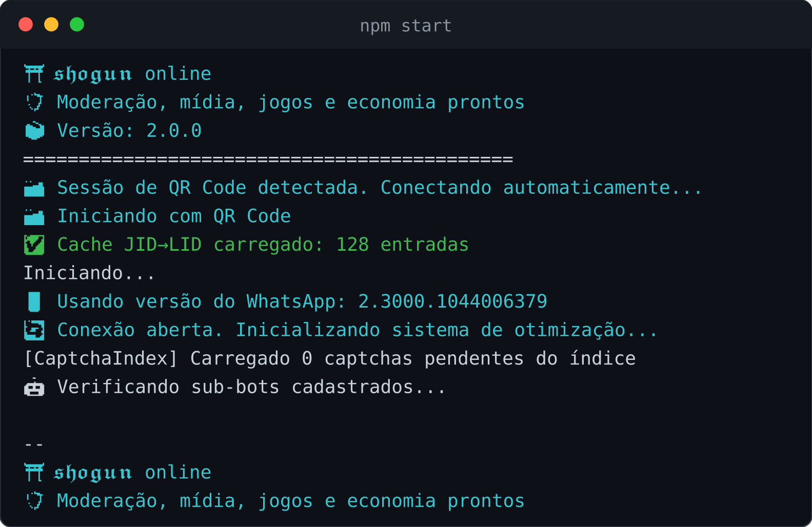
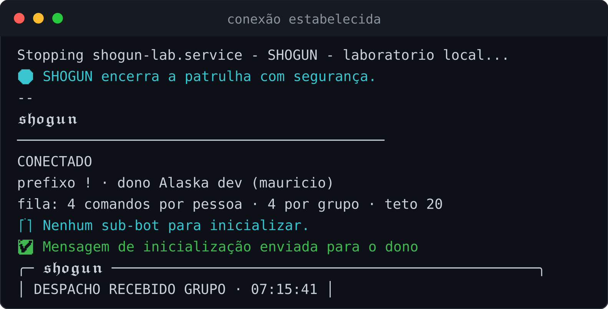

# Instalar o 𝖘𝖍𝖔𝖌𝖚𝖓 no Android

Este guia começa do zero. Você não precisa conhecer programação nem ter usado
um terminal antes. Faça uma etapa por vez e só passe para a próxima quando vir
o resultado indicado.

> **Tempo da primeira instalação:** normalmente 15 a 35 minutos. Use Wi-Fi,
> deixe o aparelho carregando e reserve pelo menos 2 GB livres.

### Como ler este guia

Cada etapa tem um bloco assim, mostrando o que deve aparecer na sua tela:

> ✅ **Deu certo se você vir:** uma descrição do que a tela mostra quando o
> passo funcionou.
>
> ⚠️ **Se aparecer outra coisa:** o erro mais comum daquele passo e o que fazer.

**Copie e cole um comando por vez.** Espere ele terminar antes do próximo — a
linha só volta a aceitar digitação quando o anterior acabou. Se a tela ficar
parada com texto correndo, está trabalhando: aguarde.

## O que você precisa antes de começar

Você vai precisar de:

- um aparelho com Android 7 ou mais recente;
- WhatsApp funcionando no número que será conectado;
- internet estável durante a instalação;
- o navegador do celular;
- de preferência, um aparelho reserva para deixar o bot ligado direto.

O 𝖘𝖍𝖔𝖌𝖚𝖓 funciona como um aparelho conectado à sua conta. Quando possível,
comece com um número e um grupo de testes antes de colocá-lo numa comunidade.

## Etapa 1 — baixar o Termux verdadeiro

O Termux é o aplicativo que abre a linha de comando onde o bot vai rodar.
Não use cópias encontradas em sites de APK e não use a edição antiga da Play
Store.

### Caminho recomendado: F-Droid

1. No Android, abra a página oficial
   [Termux no F-Droid](https://f-droid.org/packages/com.termux/).
2. Desça até **Versões** e toque em **Baixar APK** na versão sugerida.
   Você não precisa instalar a loja F-Droid para baixar esse APK.
3. O Android pode avisar que o navegador não tem permissão para instalar
   aplicativos. Toque em **Configurações**, habilite **Permitir desta fonte**
   para esse navegador e volte.
4. Toque em **Instalar**. Quando terminar, desative novamente a permissão do
   navegador se quiser manter o aparelho mais fechado.

### Alternativa: GitHub oficial

Use apenas a página [Releases do Termux](https://github.com/termux/termux-app/releases).
Em Android 7 ou mais recente, baixe uma variante `apt-android-7`. Se não souber
a arquitetura do aparelho, escolha o arquivo `universal.apk`.

> Escolha uma fonte e permaneça nela. Termux, Termux:API e Termux:Boot precisam
> vir todos do F-Droid ou todos do GitHub. Misturar fontes causa erro de
> assinatura e o Android recusa a instalação dos complementos.

> ✅ **Deu certo se você vir:** o Termux abrindo numa tela preta com um cursor
> piscando, e não uma tela de erro do Android.
>
> ⚠️ **Se o app não instalar:** quase sempre é a permissão de "instalar apps
> desconhecidos" desligada para o navegador. Volte ao passo da permissão.

## Etapa 2 — conhecer a tela preta

1. Abra o **Termux** pelo ícone recém-instalado.
2. Na primeira abertura, aguarde a linha de texto com um sinal `$` aparecer.
   Esse sinal quer dizer: “pronto para receber um comando”.
3. Para colar um comando, mantenha o dedo pressionado na tela e toque em
   **Paste/Colar**. Depois toque na tecla **Enter** do teclado.

Você sempre vai copiar **somente o conteúdo dentro da caixa**, uma caixa por
vez. Não copie o sinal `$`, números de etapa ou explicações.

> ✅ **Deu certo se você vir:** uma linha terminada em `$` esperando você
> digitar. Esse `$` é o convite: quando ele aparece, o Termux está livre.
>
> ⚠️ **Se a tela ficar em branco:** toque nela uma vez. O teclado sobe e o
> cursor volta.

## Etapa 3 — atualizar o Termux

Cole este primeiro comando e pressione Enter:

```bash
pkg update -y
```

Várias linhas vão passar pela tela. Isso é normal. Aguarde até o `$` aparecer
novamente. Se o Termux perguntar qual configuração manter, aceite a opção
padrão pressionando Enter.

Agora instale a ferramenta que vai buscar o 𝖘𝖍𝖔𝖌𝖚𝖓:

```bash
pkg install -y git
```

Espere o `$` voltar.

> ✅ **Deu certo se você vir:** várias linhas correndo e, no fim, o `$` de
> volta sem nenhuma linha começando com `E:` ou `Error`.
>
> ⚠️ **Se pedir confirmação:** digite `y` e toque em Enter. É normal.
>
> ⚠️ **Se travar em "Waiting for headers":** sua rede está instável. Aguarde
> ou troque de Wi-Fi e rode o comando de novo — repetir não estraga nada.

## Etapa 4 — baixar o 𝖘𝖍𝖔𝖌𝖚𝖓

Cole:

```bash
git clone https://github.com/dgreych/shogun.git
```

Quando aparecer `done` e o `$` voltar, entre na pasta que acabou de chegar:

```bash
cd shogun
```

O terminal não mostra uma animação ao entrar. Você pode confirmar o lugar com:

```bash
pwd
```

O fim da linha deve ser `/shogun`.

> ✅ **Deu certo se você vir:** uma pasta nova chamada `shogun`. Confirme
> digitando `ls` e Enter: o nome precisa aparecer na lista.
>
> ⚠️ **Se disser "already exists":** a pasta já foi baixada antes. Entre nela
> com `cd shogun` e siga.

## Etapa 5 — preparar o bot

Cole:

```bash
bash scripts/install-termux.sh
```

O instalador prepara Node.js, FFmpeg e os componentes do 𝖘𝖍𝖔𝖌𝖚𝖓. Pode parecer
parado durante alguns minutos; não feche o Termux. A instalação chegou ao ponto
certo quando aparecer o título **Quartel de configuração do 𝖘𝖍𝖔𝖌𝖚𝖓**.

### Responder à configuração

O assistente faz quatro perguntas. Digite a resposta e pressione Enter em cada
uma:

1. **Como o 𝖘𝖍𝖔𝖌𝖚𝖓 deve chamar você?** — por exemplo, `Mauricio`.
2. **Seu número com país e DDD** — somente dígitos. Exemplo fictício:
   `5511999999999` (`55` do Brasil, DDD e número; sem `+`, espaço ou traço).
3. **Nome do bot** — pressione Enter para manter `𝖘𝖍𝖔𝖌𝖚𝖓`.
4. **Prefixo de comando** — pressione Enter para manter `!`.

Ao final, você deve ver **Configuração local salva** e **𝖘𝖍𝖔𝖌𝖚𝖓 pronto**. O
arquivo com esses dados fica apenas no aparelho e não entra no repositório.

Se digitou algo errado, não reinstale tudo. Rode:

```bash
npm run setup
```

> ✅ **Deu certo se você vir:** as perguntas de configuração aparecendo uma a
> uma, e no fim uma mensagem de conclusão.
>
> ⚠️ **Se parar com erro de permissão:** feche o Termux por completo, abra de
> novo e repita a partir do `cd shogun`.

## Etapa 6 — conferir se está tudo certo

Cole:

```bash
npm run preflight
```

Node.js, npm, Git e FFmpeg devem aparecer aprovados. Um aviso sobre
`termux-wake-lock` não impede o primeiro teste; cuidaremos disso depois.

> ✅ **Deu certo se você vir:** uma lista de verificações com marcas de
> aprovado, sem nenhuma linha vermelha.

<p align="center">
  
</p>

<sub>Imagem gerada da execução real do comando. O aviso amarelo sobre
configuração é esperado antes da etapa seguinte.</sub>
>
> ⚠️ **Se o FFmpeg aparecer como ausente:** rode `pkg install ffmpeg -y` e
> repita a verificação.

## Etapa 7 — conectar o WhatsApp no mesmo celular

Inicie o 𝖘𝖍𝖔𝖌𝖚𝖓:

```bash
npm start
```

Na primeira vez, o terminal oferece três opções. Como WhatsApp e Termux estão
no mesmo celular, digite `2` para **código de pareamento** e pressione Enter.
Quando ele pedir o telefone, informe novamente país + DDD + número, somente
dígitos.

Um código curto aparecerá no terminal. Anote-o ou copie-o antes de sair da tela.
Agora:

1. abra o WhatsApp sem encerrar o Termux;
2. toque no menu de três pontos;
3. abra **Aparelhos conectados** ou **Dispositivos conectados**;
4. toque em **Conectar um aparelho**;
5. escolha **Conectar com número de telefone**;
6. digite o código mostrado pelo 𝖘𝖍𝖔𝖌𝖚𝖓.

Volte ao Termux. Aguarde a confirmação de conexão. Na próxima abertura, essa
sessão será reconhecida automaticamente e não será necessário parear de novo.

### Se o WhatsApp estiver em outro aparelho

Digite `1` para usar QR Code. No aparelho que tem o WhatsApp, abra **Aparelhos
conectados → Conectar um aparelho** e leia o QR mostrado no Termux.

> ✅ **Deu certo se você vir:** a palavra **CONECTADO** na tela e, logo
> depois, uma mensagem chegando no WhatsApp do dono.

<p align="center">
  
</p>

<p align="center">
  
</p>
>
> ⚠️ **Se o QR sumir antes de você ler:** ele expira em segundos e é gerado de
> novo sozinho. Deixe a câmera pronta antes de olhar a tela.
>
> ⚠️ **Se pedir o QR toda vez que reinicia:** a sessão não está sendo salva.
> Confirme que você não apagou a pasta `dados/database`.

## Etapa 8 — o primeiro comando

Com o 𝖘𝖍𝖔𝖌𝖚𝖓 conectado, abra uma conversa de teste no WhatsApp e envie:

```text
!menu
```

Se o menu chegou, a instalação está concluída. Antes de dar cargo de
administrador, teste comandos simples e leia o guia de
[primeiros passos](../primeiros-passos.md).

> ✅ **Deu certo se você vir:** o bot respondendo o `!menu` no grupo, com a
> lista de comandos.
>
> ⚠️ **Se ele não responder:** confirme que está no grupo, que o prefixo é o
> mesmo que você configurou, e que a tela do Termux ainda mostra o bot ligado.

## Etapa 9 — impedir que o Android desligue o bot

O Android economiza bateria fechando aplicativos em segundo plano. Para o
𝖘𝖍𝖔𝖌𝖚𝖓 permanecer conectado, faça as duas proteções abaixo.

### Retirar a otimização de bateria

Nas configurações do Android, procure **Aplicativos → Termux → Bateria** e
escolha algo como **Sem restrições**, **Não otimizar** ou **Permitir atividade
em segundo plano**. O nome muda conforme a marca do celular.

### Ativar o bloqueio de suspensão

Instale o aplicativo **Termux:API** pela mesma fonte usada para o Termux. Depois
abra o Termux e rode:

```bash
pkg install -y termux-api
```

Ative a proteção:

```bash
termux-wake-lock
```

Se o Android pedir confirmação, permita. Para liberar a proteção quando o bot
estiver parado, use:

```bash
termux-wake-unlock
```

## Sua rotina depois da instalação

### Abrir o 𝖘𝖍𝖔𝖌𝖚𝖓 outro dia

Abra o Termux e use, um por vez:

```bash
cd shogun
```

```bash
termux-wake-lock
```

```bash
npm start
```

### Parar com segurança

Volte ao Termux e pressione `Ctrl+C`. Na fileira extra do Termux, toque em
`CTRL` e depois na letra `C`. Quando o `$` reaparecer, o processo parou.

### Atualizar o 𝖘𝖍𝖔𝖌𝖚𝖓

Pare o bot com `Ctrl+C`, confirme que está na pasta `shogun` e rode:

```bash
git pull --ff-only
```

```bash
npm ci --no-audit --no-fund
```

```bash
npm start
```

Não apague `dados/database/qr-code/`: essa pasta contém a sessão conectada.

## Opcional — iniciar após reiniciar o celular

Só faça isto depois de ter iniciado manualmente, conectado o WhatsApp e
confirmado `!menu`.

1. Instale **Termux:Boot** pela mesma fonte usada para o Termux.
2. Toque uma vez no ícone **Termux:Boot**. Essa primeira abertura autoriza o
   complemento a agir no próximo reinício.
3. Volte ao Termux e instale o editor usado nesta etapa:

```bash
pkg install -y nano
```

4. Crie a pasta:

```bash
mkdir -p ~/.termux/boot
```

5. Abra o arquivo:

```bash
nano ~/.termux/boot/start-shogun
```

6. Cole exatamente:

```bash
#!/data/data/com.termux/files/usr/bin/bash
termux-wake-lock
cd "$HOME/shogun"
npm start >> "$HOME/shogun/termux-boot.log" 2>&1
```

7. Salve tocando em `CTRL`, depois `O`, Enter, `CTRL` e `X`.
8. Torne o arquivo executável:

```bash
chmod 700 ~/.termux/boot/start-shogun
```

O 𝖘𝖍𝖔𝖌𝖚𝖓 não altera `.bashrc` e não ativa isso sozinho. Para conferir depois
de reiniciar, abra o Termux e veja:

```bash
tail -n 40 ~/shogun/termux-boot.log
```

## Socorro rápido

- **`pkg` ou downloads falham:** troque de Wi-Fi/dados móveis, reabra o Termux
  e repita apenas o comando que falhou.
- **`cd: shogun: No such file or directory`:** o download não terminou ou você
  está em outro lugar. Rode `cd`, depois repita a etapa 4.
- **O instalador parece parado:** mantenha o aplicativo aberto; a primeira
  instalação pode levar vários minutos.
- **O código expirou:** pare com `Ctrl+C`, rode `npm start` e gere outro.
- **O bot cai com a tela apagada:** revise a bateria, rode
  `termux-wake-lock` e mantenha a notificação do Termux ativa.
- **Termux:API ou Termux:Boot não instala:** provavelmente as fontes foram
  misturadas. Todos os aplicativos Termux precisam vir da mesma fonte.
- **Apareceu um erro que você não entende:** rode `npm run preflight` e procure
  a seção correspondente em [solução de problemas](../solucao-de-problemas.md).

Nunca envie a pasta de sessão, seu código de pareamento ou uma captura contendo
credenciais. Para pedir ajuda, copie apenas a mensagem de erro.
