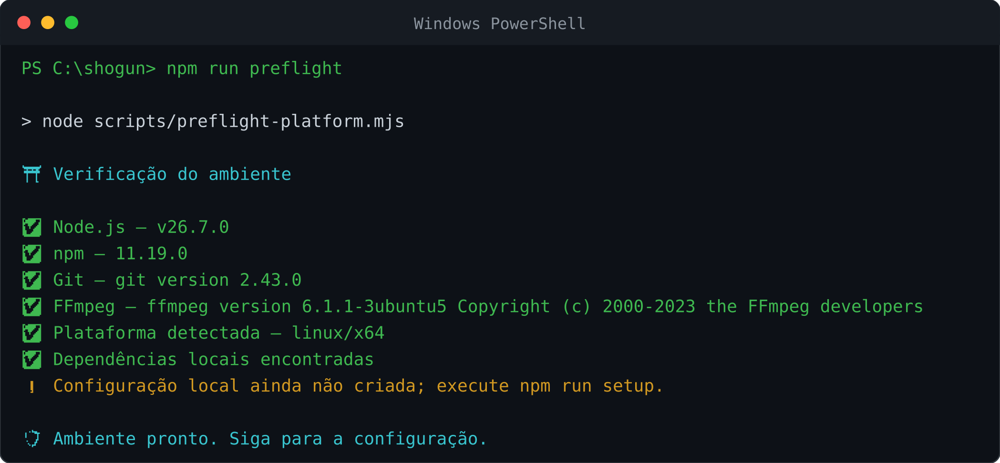

# SHOGUN no Windows: instalação para iniciantes

Este caminho serve para Windows 10 e 11. Reserve cerca de 20 minutos, use uma
conta que possa instalar programas e mantenha o computador conectado à internet.

## Etapa 1 — abrir o PowerShell

1. Abra o menu **Iniciar**.
2. Digite `PowerShell`.
3. Abra **Windows PowerShell**. Não é necessário abrir como administrador para
   rodar o SHOGUN.

Você vai copiar uma caixa por vez, colar com o botão direito ou `Ctrl+V` e
pressionar Enter. Espere o cursor voltar antes de seguir.

## Etapa 2 — instalar as ferramentas

O Windows 10/11 atualizado inclui o `winget`, instalador oficial do sistema.
Confira:

```powershell
winget --version
```

Se o comando não existir, instale ou atualize **Instalador de Aplicativo** pela
Microsoft Store, feche o PowerShell e abra-o de novo.

Instale o Git:

```powershell
winget install --id Git.Git -e --source winget
```

Instale o Node.js LTS:

```powershell
winget install --id OpenJS.NodeJS.LTS -e --source winget
```

Instale o FFmpeg:

```powershell
winget install --id Gyan.FFmpeg -e --source winget
```

Aceite os termos quando o Windows pedir. Feche completamente o PowerShell e
abra uma janela nova para que os novos comandos sejam reconhecidos.

Se preferir instalar clicando, use somente as páginas oficiais de
[Node.js](https://nodejs.org/en/download),
[Git](https://git-scm.com/install/windows) e
[FFmpeg](https://ffmpeg.org/download.html). Escolha Node.js 22 ou 24 LTS e
lembre-se de adicionar FFmpeg ao `PATH`.

## Etapa 3 — conferir o terreno

Na janela nova, rode um por vez:

```powershell
node --version
```

```powershell
npm --version
```

```powershell
git --version
```

```powershell
ffmpeg -version
```

Cada comando deve mostrar uma versão. Se algum disser “não é reconhecido”,
reinicie o computador uma vez antes de reinstalar.

## Etapa 4 — baixar o SHOGUN

Escolha uma pasta simples. Este comando vai para sua pasta de usuário:

```powershell
Set-Location $HOME
```

Baixe o projeto:

```powershell
git clone https://github.com/dgreych/shogun.git
```

Entre no quartel:

```powershell
Set-Location shogun
```

## Etapa 5 — preparar e configurar

```powershell
powershell -ExecutionPolicy Bypass -File .\scripts\install-windows.ps1
```

O preparo baixa os componentes do bot e depois faz quatro perguntas:

1. como o SHOGUN deve chamar você;
2. seu número com país e DDD, somente dígitos — exemplo fictício
   `5511999999999`;
3. nome do bot — pressione Enter para manter `SHOGUN`;
4. prefixo — pressione Enter para manter `!`.

Espere aparecer **SHOGUN pronto**. Para corrigir uma resposta depois, use:

```powershell
npm run setup
```

## Etapa 6 — inspeção e conexão

```powershell
npm run preflight
```

<p align="center">
  
</p>

<sub>Imagem gerada da execução real do comando. O aviso amarelo sobre
configuração é esperado antes da etapa seguinte.</sub>

Se todos os itens obrigatórios estiverem aprovados, inicie:

```powershell
npm start
```

Escolha `1` para QR Code. No telefone, abra WhatsApp → menu de três pontos →
**Aparelhos conectados/Dispositivos conectados → Conectar um aparelho** e leia
o QR da tela do computador.

Se a câmera não puder ler a tela, pare com `Ctrl+C`, inicie novamente, escolha
`2` e siga o código de pareamento.

## Etapa 7 — confirmar a primeira missão

Numa conversa de teste, envie:

```text
!menu
```

Recebeu o menu? O posto está pronto. O PowerShell precisa permanecer aberto
enquanto o SHOGUN estiver em serviço.

## Sua rotina

Para parar com segurança, clique no PowerShell e pressione `Ctrl+C`.

Para voltar outro dia:

```powershell
Set-Location "$HOME\shogun"
```

```powershell
npm start
```

Para atualizar, pare o bot e rode:

```powershell
git pull --ff-only
```

```powershell
npm ci --no-audit --no-fund
```

```powershell
npm start
```

Não copie apenas `node_modules` para outro PC. Em uma máquina nova, clone o
projeto e execute o instalador novamente. Preserve com cuidado a pasta local de
sessão; ela vale como uma chave do WhatsApp.

## Socorro rápido

- **Execução de scripts foi desabilitada:** use exatamente o comando com
  `-ExecutionPolicy Bypass` mostrado na etapa 5; ele vale apenas para esse
  instalador.
- **`ffmpeg` não é reconhecido:** feche todas as janelas do PowerShell e abra
  outra. Se persistir, reinstale o FFmpeg e reinicie o Windows.
- **O QR ficou pequeno:** maximize a janela ou use código de pareamento.
- **A pasta `shogun` já existe:** entre nela com `Set-Location shogun`; não
  clone por cima.
- **Ainda não funcionou:** rode `npm run preflight` e consulte
  [solução de problemas](../solucao-de-problemas.md).
